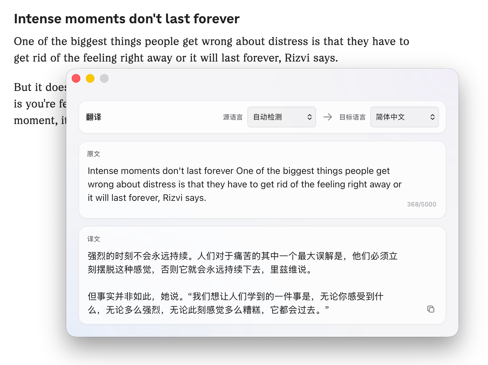

<p align="center">
  
</p>

<h1 align="center">OpenScreenTranslate</h1>

<p align="center">
  <a href="./README.md">English</a> | <strong>简体中文</strong>
</p>

<p align="center">
  一款由 AI 驱动的开源 macOS 菜单栏截图翻译工具，帮助你快速识别并翻译屏幕文本。
</p>

<p align="center">
  <a href="https://github.com/MarcMQC/open-screen-translate/releases"><strong>下载最新 macOS DMG 安装包</strong></a>
</p>

使用翻译功能前，需要自行申请并配置受支持 AI 服务供应商的 API Key。

OpenScreenTranslate 基于 Tauri 2、Rust、ScreenCaptureKit 与 Apple Vision 构建。应用常驻菜单栏，不显示 Dock 图标，并支持截图翻译与手动输入翻译。OCR 在本机完成，只有待翻译文本会发送至用户选择的 AI 服务。

## 界面预览

<p align="center">
  
</p>

<p align="center"><sub>支持自动检测源语言、编辑 OCR 原文和流式显示译文。</sub></p>

## 功能特性

- 使用可自定义的全局快捷键框选屏幕区域，按 `Esc` 取消截图
- 使用 Apple Vision 在本机识别选区内的多语言文本
- 自动合并 OCR 产生的视觉换行，并根据空行、句末标点与列表结构进行轻量分段
- 允许编辑识别结果，修正 OCR 误差后重新翻译
- 使用独立快捷键直接打开手动翻译窗口
- 翻译结果以流式方式逐步显示，结果窗口会随内容平滑调整高度
- 支持 DeepSeek、OpenAI、Anthropic Claude、Google Gemini 与自定义兼容服务
- 所有服务均可配置模型名称和完整请求 URL
- API Key 仅保存在 macOS 钥匙串中，不写入普通配置文件
- 首次启动通过引导页完成屏幕录制权限、AI 服务、默认语言、快捷键与启动偏好设置
- 支持登录 macOS 时自动启动

## 系统要求

- macOS 14 或更高版本
- 屏幕录制权限
- 至少一个受支持 AI 服务的 API Key 或兼容接口

## 安装

### 从发布页面安装

从仓库的 [GitHub Releases 页面](https://github.com/MarcMQC/open-screen-translate/releases)下载最新 `.dmg`，打开后将 OpenScreenTranslate 拖入“应用程序”文件夹。首次启动时，请按照引导页授予屏幕录制权限、配置 AI 服务并选择使用偏好。

### 从源码运行

开发环境需要 Node.js 20 或更高版本、Rust stable 与 Xcode Command Line Tools。

```bash
git clone https://github.com/MarcMQC/open-screen-translate.git
cd open-screen-translate
npm install
npm run tauri dev
```

## 使用方式

1. 完成首次启动引导，包括屏幕录制权限和 AI 服务 API Key。
2. 使用“截图并翻译”快捷键框选屏幕内容，或使用“翻译”快捷键手动输入文本。
3. 在翻译窗口中调整源语言和目标语言；识别文本不准确时可直接修改原文。

截图识别得到的原文会先进行轻量排版：同一句内由页面宽度造成的换行会自动合并，
明确空行、句末标点后的新句以及列表项会尽量保留为独立段落。该处理只应用于 OCR
结果，手动输入的排版不会被改写。翻译开始后，译文会随着 AI 服务返回的数据逐步
填充；窗口会在屏幕可用范围内自动增高，内容较短时及时回缩，长文本达到高度上限后
则在文本区域内滚动。

新安装默认使用 `Command+1` 截图并翻译、`Command+2` 打开手动翻译，登录时自动启动默认关闭。应用启动时会检查屏幕录制权限和当前 AI 服务的 API Key；任一项缺失时会重新打开引导页。

## 开发

安装与开发命令：

| 命令 | 用途 |
| --- | --- |
| `npm install` | 安装前端与 Tauri CLI 依赖 |
| `npm ci` | 根据 `package-lock.json` 执行可复现的干净安装，适合持续集成环境 |
| `npm run tauri dev` | 启动开发版本 |
| `npm run dev` | 只启动 Vite 前端开发服务器，不启动桌面应用 |
| `npm run build` | 执行 TypeScript 检查并构建前端 |
| `npm run preview` | 本地预览已构建的前端页面 |
| `npm run tauri -- <command>` | 直接调用项目内安装的 Tauri CLI |

检查与维护命令：

| 命令 | 用途 |
| --- | --- |
| `npm run check` | 执行敏感信息扫描、格式检查、前端构建、Rust 测试和 Clippy |
| `npm run security:check` | 单独扫描常见密钥、私钥及不应提交的敏感文件 |
| `npm run version:sync` | 将根目录 `VERSION` 同步到各构建配置 |
| `npm run version:check` | 检查各构建配置中的版本是否与 `VERSION` 一致 |
| `npm run settings:delete` | 永久删除应用设置及钥匙串中保存的 AI 服务 API Key |
| `npm run reset:macos:screen-capture` | 重置应用的 macOS 屏幕录制授权记录 |

macOS 构建与发布命令：

| 命令 | 用途 |
| --- | --- |
| `npm run build:macos:debug` | 生成仅供本机测试的 Debug `.app` |
| `npm run build:macos:debug:dmg` | 生成使用本地 ad-hoc 签名且不提交公证的 Debug DMG |
| `npm run build:macos:app` | 构建本地 Release `.app` |
| `npm run release:macos:setup` | 将 Apple 公证凭据安全保存到 macOS 钥匙串 |
| `npm run release:macos` | 构建、签名、公证并验证当前架构的 DMG |
| `npm run release:macos:resume` | 继续等待并处理此前已提交的公证任务 |
| `npm run release:macos:universal` | 构建同时支持 Apple Silicon 与 Intel 的 DMG |

`package.json` 还包含以下 npm 生命周期钩子。运行对应主命令时，npm 会自动执行这些钩子，通常不需要手动调用：

| 自动钩子 | 在何时执行 | 用途 |
| --- | --- | --- |
| `predev` | `npm run dev` 之前 | 同步项目版本号 |
| `prebuild` | `npm run build` 之前 | 同步项目版本号 |
| `prebuild:macos:app` | `npm run build:macos:app` 之前 | 同步项目版本号 |
| `prerelease:macos` | `npm run release:macos` 之前 | 同步项目版本号 |
| `prerelease:macos:universal` | `npm run release:macos:universal` 之前 | 同步项目版本号 |
| `pretauri` | `npm run tauri -- <command>` 之前 | 同步项目版本号 |

项目结构：

```text
src/                  前端界面与交互
src-tauri/src/        Tauri 命令、翻译和凭据存储
src-tauri/native/     ScreenCaptureKit 与 Apple Vision 原生实现
scripts/              检查、签名与发布脚本
docs/                 项目维护文档
```

开发构建会记录选区坐标、Retina 像素换算、OCR 字符数、翻译耗时与 token 用量，但不会记录 API Key 或完整翻译内容。发布构建只保留错误诊断信息。

### 版本管理

根目录的 [`VERSION`](VERSION) 是项目版本号的唯一来源。发布新版本时只修改该文件，然后执行 `npm run version:sync`。开发、构建与 Tauri 命令也会在运行前自动同步 `package.json`、`package-lock.json`、Cargo 和 Tauri 配置；`npm run check` 会检查这些派生值是否一致。

## 构建与发布

生成本地 Debug 应用：

```bash
npm run build:macos:debug
```

产物位于 `src-tauri/target/debug/bundle/macos/OpenScreenTranslate.app`。脚本会自动同步 `VERSION`，使用 Debug 配置构建，并施加本机 ad-hoc 签名；它不会生成 DMG、使用 Developer ID 或提交 Apple 公证，仅用于本地测试。本地签名包含稳定的 Bundle ID designated requirement，因此后续使用该脚本重新构建时可以继续匹配同一条系统授权。

需要测试完整安装界面时，可以生成无需 Developer ID 和 Apple 公证的 Debug DMG：

```bash
npm run build:macos:debug:dmg
```

产物位于 `src-tauri/target/debug/bundle/dmg/`，文件名以 `_debug.dmg` 结尾。脚本会对 DMG 内的应用施加相同的本地 ad-hoc 签名，并生成 `.sha256` 校验文件；该产物仅用于本机或受控测试，不可公开分发。

如果曾使用旧版脚本构建并授权过应用，需要清理一次旧的 `cdhash` 授权：

```bash
npm run reset:macos:screen-capture
```

随后完全退出 OpenScreenTranslate，启动新构建，重新勾选屏幕录制权限，并再次退出重启。正式 Developer ID 签名版本使用另一套可信签名身份，首次安装仍需单独授权。

生成本地 Release 应用：

```bash
npm run build:macos:app
```

产物位于 `src-tauri/target/release/bundle/macos/OpenScreenTranslate.app`。Developer ID 签名、公证和通用 DMG 的完整流程请阅读[发布指南](docs/RELEASING.md)。

## 卸载与数据清理

完全退出应用后，将 `OpenScreenTranslate.app` 移到废纸篓即可卸载应用本体。macOS 不会自动删除应用设置及钥匙串中的 API Key；如果仍保留源码目录，可执行：

```bash
npm run settings:delete
```

该命令会先列出删除范围并要求确认。屏幕录制授权记录由 macOS 管理，需要时可另行执行 `npm run reset:macos:screen-capture`。

## 隐私与安全

- OCR 由 Apple Vision 在本机完成
- 只有待翻译文本会发送到用户选择并配置的 AI 服务
- 各供应商 API Key 独立保存在 macOS 钥匙串中
- 请勿在 Issue、日志或截图中提交 API Key 等敏感信息

安全问题请按照[安全策略](SECURITY.md)私下报告。

### 上传 GitHub 前检查

```bash
npm run check
```

该命令包含高置信度敏感信息扫描。仍应人工确认提交列表中不包含 `.env`、证书、私钥、Apple 公证文件、API Key、构建产物或个人数据；请勿使用 `git add -f` 强制提交被 `.gitignore` 排除的文件。

## 参与贡献

欢迎提交 Issue 和 Pull Request。开始前请阅读[贡献指南](CONTRIBUTING.md)与[行为准则](CODE_OF_CONDUCT.md)。

## 许可证

本项目基于 [MIT License](LICENSE) 开源。
